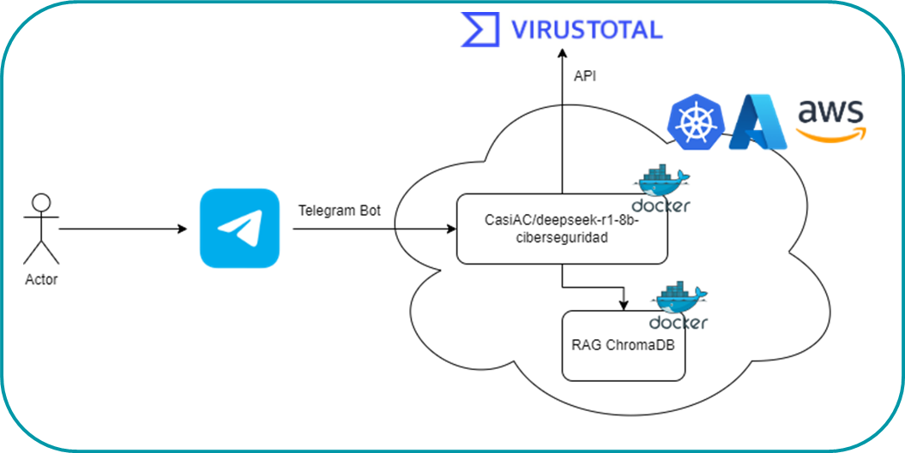

# ZeroScam


ZeroScam es una herramienta completa de ciberseguridad pensada para que usuarios puedan consultar dudas referentes a la seguridad digital, prevención de ciberestafas y consulta de normativas. 

Se trata de un Agente IA que usa DeepSeek R1 como modelo base con un finetuning con un dataset formado por la fusión de varios datasets pregunta-respuesta sobre temas de ciberseguridad. 

Además se ha alimentado el contexto con un RAG con las normativas:
* NIST
* GDPR
* ISO 27001 

Esto permite conocer con detalle aspectos de estas normativas y consultar detalles sobre las mismas evitando que el modelo alucine con esta información. 

A continuación se detalla la arquitectura establecida:



La aplicación se ha dockerizado con una imagen base CUDA para ser más eficiente utilizando los recursos de GPU. La idea detrás de esto es poder ejecutar el modelo en cualquier servicio de nube con capacidad de GPU, como Kubernetes, Azure o AWS.


## RAG Normativa de Ciberseguridad

La técnica **Retrieval-Augmented Generation (RAG)**, o **Generación Aumentada por Recuperación**, 
es una metodología innovadora que combina la potencia de los modelos de lenguaje de gran escala (LLM)
con la capacidad de recuperar información externa y actualizada. Esto permite que el modelo no se limite
únicamente a su conocimiento preentrenado, sino que pueda acceder a datos recientes y específicos, lo 
que resulta fundamental en un campo tan dinámico como la ciberseguridad.

### ¿Qué es RAG?

RAG integra dos componentes esenciales:

1. **Recuperación (Retrieval):**  
   Permite buscar y extraer información relevante de bases de datos o documentos normativos, brindando 
   al modelo acceso a datos actualizados y especializados.

2. **Generación (Generation):**  
   Utiliza un modelo de lenguaje para generar respuestas enriquecidas con la información recuperada. 
   En este caso, se utiliza el modelo **Deepseek R1 8B Ciberseguridad**, que ha sido previamente entrenado
   mediante técnicas de **Fine-tuning** y **LoRA**.

Esta combinación mejora notablemente la precisión y relevancia de las respuestas, ya que el modelo puede 
complementar su conocimiento interno con datos externos verificados.

---

### Aplicación en la Normativa de Ciberseguridad

El notebook implementa una solución RAG para potenciar el rendimiento del modelo **Deepseek R1 8B Ciberseguridad**. 
La integración de la normativa de ciberseguridad permite que el modelo:

- **Acceda a información actualizada:**  
  Consulta en tiempo real documentos normativos y estándares reconocidos.

- **Genere respuestas contextualizadas:**  
  Combina su conocimiento preentrenado con información específica y reciente para ofrecer respuestas fundamentadas.

- **Mejore la precisión:**  
  Al basar sus respuestas en datos oficiales, aumenta la fiabilidad y relevancia de la información proporcionada.

---

### Documentos Normativos Utilizados

El sistema RAG se apoya en un conjunto de documentos clave que abarcan diversos aspectos de la ciberseguridad:

- **GDPR 2016/679:**  
  Reglamento General de Protección de Datos de la Unión Europea, que establece las bases para la protección 
  de datos personales y la privacidad.

- **GDPR 2018/1725:**  
  Normativa orientada a la protección de datos en instituciones de la Unión Europea, aplicada en organismos 
  públicos y entidades gubernamentales.

- **ISO 27001:2022:**  
  Norma internacional para la gestión de la seguridad de la información, que proporciona un marco para establecer,
  implementar y mejorar un Sistema de Gestión de Seguridad de la Información (SGSI).

- **NIST:**  
  Marco de seguridad cibernética del Instituto Nacional de Estándares y Tecnología (EE.UU.), que ofrece directrices, 
  mejores prácticas y estándares para la gestión del riesgo y la protección de la información.

---

### Arquitectura del Sistema

El sistema se compone de varias partes integradas que permiten su funcionamiento de manera conjunta:

- **Recuperación de Documentos:**  
  Los documentos normativos se indexan y almacenan en una base de datos (por ejemplo, ChromaDB) para facilitar su 
  búsqueda y recuperación.

- **Generación Aumentada (RAG):**  
  El modelo Deepseek utiliza la información recuperada para generar respuestas detalladas y precisas, aprovechando
  tanto su conocimiento preentrenado como los datos externos.

- **Interfaz de API:**  
  Se emplea **FastAPI** para exponer el servicio, y mediante **ngrok** se genera una URL pública que permite 
  integrar y probar la solución en entornos remotos, como Google Colab.

---

### Beneficios de la Solución RAG en Ciberseguridad

La integración de la normativa en un sistema RAG ofrece múltiples ventajas:

- **Actualización Continua:**  
  El modelo puede acceder a información normativa actualizada, lo que es esencial en un campo en constante evolución.

- **Respuestas Contextualizadas y Precisasy:**  
  Las respuestas se enriquecen con datos específicos y relevantes, lo que mejora la calidad y exactitud de las 
  soluciones proporcionadas.

- **Facilidad de Integración:**  
  La combinación de FastAPI y ngrok permite exponer el servicio a entornos remotos, facilitando la integración con 
  otras aplicaciones y sistemas.

- **Adaptabilidad y Escalabilidad:**  
  La técnica RAG es flexible y puede ampliarse para cubrir otros ámbitos o conjuntos de datos, aumentando así su 
  utilidad en diversas áreas del conocimiento.

---

### Conclusión

Este notebook demuestra cómo la técnica **RAG (Retrieval-Augmented Generation)** puede revolucionar la forma de 
abordar la ciberseguridad mediante:

- **Recuperación de Información Actualizada:**  
  El modelo accede a documentos normativos y datos recientes para fundamentar sus respuestas.

- **Generación de Respuestas Contextualizadas:**  
  Al combinar su conocimiento interno con información externa, el modelo ofrece respuestas más precisas y adaptadas
  a las necesidades reales del entorno de la seguridad de la información.

- **Integración Sencilla y Eficiente:**  
  Gracias a FastAPI y ngrok, el sistema se integra fácilmente en entornos remotos, permitiendo pruebas y adaptaciones 
  rápidas.

Con esta configuración, el modelo **Deepseek R1 8B Ciberseguridad** puede proporcionar respuestas informadas, 
relevantes y contextualizadas a preguntas relacionadas con la seguridad de la información, marcando un avance 
significativo en la aplicación de técnicas RAG en el ámbito de la ciberseguridad.

## Módulo de Consulta a VirusTotal

Este módulo permite verificar la seguridad de direcciones **IP** y **URLs** utilizando la API de **VirusTotal**. Se integra con un modelo de lenguaje para detectar direcciones sospechosas en un texto y generar respuestas automáticas.

### Requisitos
Para utilizar este módulo, es necesario contar con una clave de API de VirusTotal y acceso a una conexión a internet.

### Funcionalidades
#### 1. Consulta de IPs
El módulo permite verificar si una dirección IP ha sido reportada como maliciosa en VirusTotal. Devuelve un informe con la cantidad de detecciones y una evaluación de seguridad basada en los análisis disponibles.

#### 2. Consulta de URLs
Se puede analizar una URL para determinar si ha sido identificada como maliciosa. El módulo envía la URL a VirusTotal, obtiene los resultados del análisis y proporciona un veredicto de seguridad.

#### 3. Detección Automática en Texto
Si un usuario proporciona un mensaje que contiene una IP o URL, el módulo detecta automáticamente la información y consulta VirusTotal sin necesidad de una solicitud manual.

#### 4. Generación de Respuestas Inteligentes
El módulo no solo analiza direcciones, sino que también genera respuestas automatizadas. Si no se detecta una IP o URL, responde de manera normal utilizando un modelo de lenguaje.

## Aplicacion normativa para posterior RAG

### Paso 1: Conversión de PDF a JSON
#### ¿Qué hicimos?
Transformamos los documentos en formato PDF a JSON, extrayendo el texto y organizándolo por páginas.

#### ¿Por qué lo hicimos?
- Los PDFs no son fácilmente manipulables en NLP o bases de datos.
- Un formato estructurado (JSON) permite trabajar con el texto fácilmente, conservando su estructura original.
- Facilita el procesamiento posterior, como la segmentación y extracción de información relevante.

### Paso 2: Limpieza del Texto
#### ¿Qué hicimos?
Aplicamos un preprocesamiento de texto eliminando caracteres innecesarios, espacios adicionales y normalizando el contenido.

#### ¿Por qué lo hicimos?
- El texto extraído puede contener símbolos y caracteres especiales que no aportan valor.
- La limpieza mejora la calidad del análisis NLP, eliminando ruido que podría afectar la tokenización y generación de embeddings.

### Paso 3: Tokenización y Segmentación con Ventanas Deslizantes
#### ¿Qué hicimos?
- Dividimos el texto en oraciones y eliminamos stopwords y puntuación.
- Agrupamos las oraciones en fragmentos superpuestos llamados ventanas deslizantes para preservar el contexto.

### Paso 4: Generación de Embeddings
#### ¿Qué hicimos?
Convertimos cada fragmento de texto en vectores numéricos (embeddings) usando modelos de lenguaje preentrenados.

#### ¿Por qué lo hicimos?
- Los embeddings permiten comparar significados de textos, en lugar de depender solo de coincidencias exactas de palabras.
- Son esenciales para hacer búsquedas semánticas en bases de datos vectoriales.

### Paso 5: Almacenamiento en ChromaDB
#### ¿Qué hicimos?
Guardamos los embeddings en ChromaDB, una base de datos vectorial optimizada para búsquedas semánticas.

#### ¿Por qué lo hicimos?
- Las bases de datos vectoriales permiten encontrar documentos similares en significado, no solo por palabras clave exactas.
- Optimiza la búsqueda en textos largos como normativas y regulaciones.


## Tesseract OCR

### Introducción

Este módulo implementa un sistema de reconocimiento óptico de caracteres (OCR) optimizado, utilizando Tesseract como motor principal. Se realizaron pruebas comparativas con diferentes frameworks de OCR para determinar la mejor opción en términos de precisión y rendimiento.

### Evaluación de Modelos OCR

Se analizaron tres soluciones de OCR para determinar cuál ofrecía el mejor desempeño en términos de exactitud y velocidad:

- **PaddleOCR**
- **EasyOCR**
- **Tesseract**

Tras una serie de pruebas, **Tesseract fue seleccionado** como la mejor opción debido a su equilibrio entre precisión y eficiencia en el procesamiento de textos en imágenes.

### Uso

Para procesar una imagen y extraer su texto, se emplea la función `extraer_texto_img`, que incluye técnicas de preprocesamiento antes de aplicar Tesseract OCR. La implementación utilizada en el notebook es la siguiente:

``python

from PIL import Image, ImageEnhance
import pytesseract

def limpiar_texto(texto):
    """ Elimina espacios y carácteres no deseados. """
    texto = texto.strip()
    texto = re.sub(r'\s+', ' ', texto)
    return texto.replace("\n", " ").replace("\r", "")

def preprocesar_imagen(imagen):

    """Convierte la imagen a escala de grises y mejora el contraste."""
    try:
       image = Image.open(imagen).convert("L")
        enhancer = ImageEnhance.Contrast(image)

        return enhancer.enhance(2.0)

    except Exception as e:

        return None

def extraer_texto_img(imagen):
    """Extrae y limpia el texto de una imagen."""
    image = preprocesar_imagen(imagen)
    if image is None:
        return "Error al procesar la imagen"
    texto_extraido = pytesseract.image_to_string(image)

    return limpiar_texto(texto_extraido)

```

### Detalles Técnicos

Para mejorar la precisión del OCR, se aplicaron las siguientes técnicas de preprocesamiento:

- **Conversión a escala de grises**: Reduce el ruido de color y mejora la detección de caracteres.
- **Ajuste de contraste**: Mejora la legibilidad del texto en imágenes con iluminación deficiente.

Estas optimizaciones garantizan que Tesseract reciba imágenes en un formato óptimo para la detección de texto.

### Resultados

Ejemplo de salida esperada:

```
Texto extraído de la imagen con OCR optimizado.
```

Este texto extraído de las imágenes se incluye en el PipeLine de consulta a VirusTotal para en caso de detectar una URL o IP consultar a la API. 
