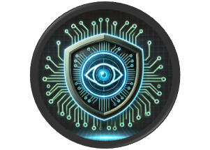
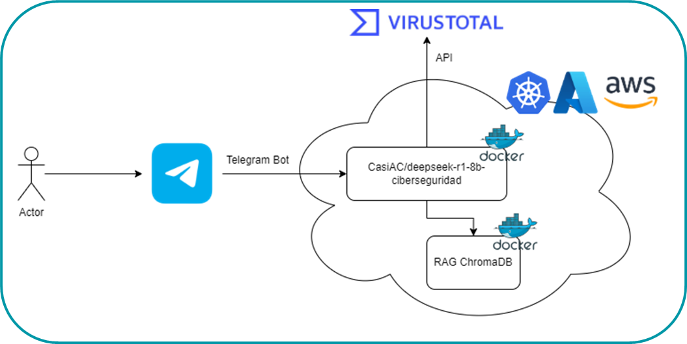
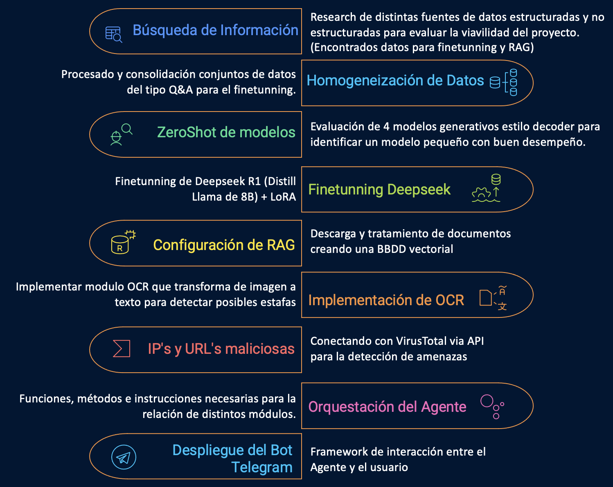
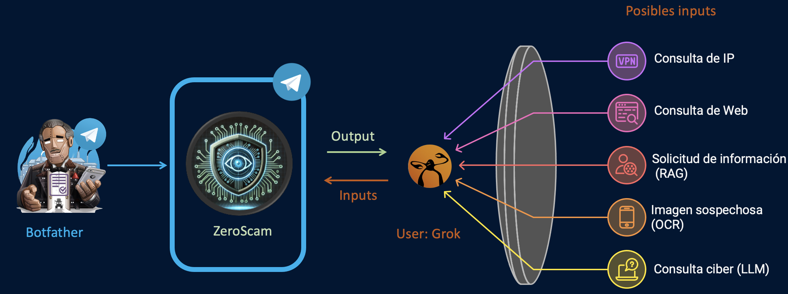

# ZeroScam


ZeroScam es una herramienta completa de ciberseguridad pensada para que usuarios puedan consultar dudas referentes a la seguridad digital, prevención de ciberestafas y consulta de normativas. 

Se trata de un Agente IA que usa DeepSeek R1 como modelo base con un finetuning con un dataset formado por la fusión de varios datasets pregunta-respuesta sobre temas de ciberseguridad. 

Además se ha alimentado el contexto con un RAG con las normativas:
* NIST
* GDPR
* ISO 27001 

Esto permite conocer con detalle aspectos de estas normativas y consultar detalles sobre las mismas evitando que el modelo alucine con esta información. 

A continuación se detalla la arquitectura establecida:



La aplicación se ha dockerizado con una imagen base CUDA para ser más eficiente utilizando los recursos de GPU. La idea detrás de esto es poder ejecutar el modelo en cualquier servicio de nube con capacidad de GPU, como Kubernetes, Azure o AWS.

## Estructura del proyecto
```bash
ZeroScam/
├── app/                         # Aplicación principal
│   ├── Dockerfile               # Configuración para contenedor Docker
│   ├── requirements.txt         # Dependencias del proyecto
│   └── zeroscam.py              # Script principal
├── data/                        # Generación de dataset final
├── docs/                        # Documentación del proyecto
│   ├── ZeroScam_Origin.pptx     # Presentación de introducción al proyecto
│   ├── ZeroScam.docx            # Documento detallado sobre ZeroScam
│   └── ZeroScamArchitecture.drawio # Diagrama de arquitectura del sistema
├── images/                      # Imágenes utilizadas en la documentación
├── model/                       # Modelos de IA utilizados en todas las etapas del proyecto. El modelo final está en Hugging Face: CasiAC/deepseek-r1-8b-ciberseguridad
│   ├── Deepseek_R1_8B_Ciberseguridad.ipynb # Modelo Deepseek especializado en ciberseguridad
│   ├── Finetunning_Deepseek_R1_8B_LoRA.ipynb # Ajuste fino con LoRA para Deepseek
│   ├── Finetunning_Mistral.ipynb # Ajuste fino de un modelo Mistral
│   ├── Model+OCR.ipynb          # Integración de modelo de IA con OCR
│   └── ZeroShot.ipynb           # Implementación de aprendizaje Zero-Shot
├── ocr/                         # Scripts de reconocimiento óptico de caracteres
│   ├── images/                  # Imágenes de prueba para OCR
│   ├── OCRs.ipynb               # Implementación básica de OCR
│   └── UpgradedTesseractOCR.ipynb # Versión mejorada con Tesseract OCR
├── pipeline/                    # Procesos y pruebas del modelo
│   ├── Analyze_URL.ipynb        # Análisis de URLs sospechosas
│   └── Prueba_Modelo.ipynb      # Prueba de funcionamiento del modelo
├── rag/                         # Implementación de Retrieval-Augmented Generation
│   └── RAG_Ciberseguridad_Normativa.ipynb # Sistema RAG para normativa de ciberseguridad
├── regulaciones/                # Archivos relacionados con normativas y regulaciones
├── telegram/                    # Integración con Telegram
│   ├── model_loader.py          # Carga del modelo en el bot
│   ├── telegram_bot.ipynb       # Implementación del bot en Jupyter Notebook
│   └── telegram_bot.py          # Código principal del bot de Telegram
├── .gitignore                   # Archivos y carpetas ignorados por Git
├── README.md                    # Documentación principal del repositorio
└── ZeroScam.ipynb               # Versión completa de la aplicación para ejecutar el modelo
```

## Ejecución

La forma más sencilla de ejecutar el proyecto es ejecutar el notebook `ZeroScam.ipynb` en Google Colab con un entorno de ejecución A100. El único requisito será actualizar los tokens necesarios:

```python
# TOKEN ngrok 
ngrok.set_auth_token("Tu Ngrok token")

# VirusTotal API Key
API_KEY = "Tu VirusTotal API Key"

# Telegram Token
TELEGRAM_TOKEN = "Tu telegram bot token"
```

También se ha dockerizado la aplicación pudiendo ejecutarla en cualquier entorno de nube optimizado para uso de GPUs. PAra construir la imagen, ir a la carpeta /app y ejecutar:

```docker build -t zeroscam-app .```

Para ejecutar el contenedor: 

```docker run --gpus all -p 8000:8000 -e TELEGRAM_TOKEN="TU_TOKEN" zeroscam-app```

A continuación se detalla el desarrollo realizado.

## Desarrollo

Para el desarrollo del Agente se han abordado distintos pasos resumidos en el siguiente flujo:



---
### Búsqueda de información

El primer paso fue realizar un estudio de viabilidad del proyecto buscando fuentes de datos estructuradas y no estructuradas que pudieran servir para entrenar un modelo de lenguaje generativo y alimentar el contexto por medio de documentos con RAG.

Se detectaron un gran número de fuentes de datos entre las que se destacan:

* Datasets de HuggingFace
* Corpus de ciberseguridad
* Smishing datasets
* INCIBE
* Truecaller
* Phistank
* Kaggel
* Wikipedia
* ISO
* ...

En este momento, se definieron las bases principales de acción, que son las aplicaciones que realiza el agente de IA desarrollado ZeroScam.

---

### 📚 Homegeneización de Datos

Para el entrenamiento del modelo llm, de las distintas fuentes de datos encontradas, se han seleccionado **4 datasets especializados** en ciberseguridad de HuggingFace que contienen información sobre **ataques, defensa, normativas y buenas prácticas**. 

Estos datasets son del formato Q&A con la siguiente estructura:

* Contexto
* Pregunta
* Respuesta

Los 4 datasets han pasado por un proceso ETL. Como el número de observaciones era masivo y ralentizaría el entrenamiento del modelo, se optó por hacer una selección aleatoria disminuyendo el tamaño muestral.

| **Dataset** | **Descripción** | **Ejemplos** |  
|------------|---------------|-------------|  
| `ahmed000000000/cybersec` | Seguridad informática general | 2.500 |  
| `dzakwan/cybersec` | Amenazas y defensa en ciberseguridad | 2.500 |  
| `asimsultan/cyber2k` | Distintos aspectos de ciberseguridad | 2.000 |  
| `Vanessasml/cybersecurity_32k_instruction_input_output` | Instrucción-respuesta para modelos conversacionales | 2.500 |  

🔹 **Total de ejemplos**: **9.500 muestras** de texto enfocadas en ciberseguridad.  

Estos datasets han sido **procesados y combinados** para mejorar la capacidad de **comprensión y respuesta** del modelo ante preguntas relacionadas con **seguridad informática y normativas**. 

Una vez tuvimos el dataset limpio, dividimos en tres ficheros con un fin concreto:

* 80% del dataser para el entrenamiento
* 10% del dataset para la validación
* 10% del dataser para el test

---

### ZeroShot

Antes de entrenar un modelo LLM especializado en ciberseguridad, realizamos una evaluación comparativa de cuatro modelos generativos con arquitectura *decoder-only* en un escenario *ZeroShot*. El objetivo era determinar cuál presentaba el mejor desempeño sin necesidad de ajuste previo (*finetuning*).  

Los modelos evaluados fueron:  

- **GPT-2 (1.5B)** – Modelo de menor tamaño y sin preentrenamiento en instrucciones modernas, con un rendimiento limitado en tareas complejas.  
- **Llama 2 (7B)** – Modelo más avanzado con mejor capacidad de razonamiento, pero sin adaptaciones específicas para nuestra tarea.  
- **Mistral-7B + LoRA** – Incorporación de *Low-Rank Adaptation* (LoRA) para mejorar la adaptación a nuevas tareas con eficiencia computacional.  
- **Deepseek R1 (Distilled Llama 8B) + LoRA** – Modelo optimizado con distilación y LoRA, permitiendo una mejor compresión de instrucciones y generalización.  

Los modelos fueron comparados en tareas de generación de respuestas en ciberseguridad sin ejemplos previos (*zeroshot*), evaluando métricas como coherencia, precisión técnica y cobertura del tema. Las estimaciones de desempeño mostraron que **Deepseek R1 + LoRA obtuvo los mejores resultados**, destacándose por:  

✅ **Mejor comprensión de instrucciones**, reflejada en respuestas más precisas y estructuradas.  
✅ **Mayor capacidad de generalización**, superando en cobertura a modelos sin ajuste previo.  
✅ **Eficiencia computacional**, logrando un equilibrio óptimo entre tamaño (8B) y rendimiento.  

Con base en estos resultados, decidimos realizar el *finetuning* sobre **Deepseek R1 + LoRA**, optimizándolo para tareas especializadas en ciberseguridad. 

---
### 🛠 Fine-Tuning DeepSeek R1 (Distill Llama 8B) + LoRA para el Agente de Ciberseguridad ZeroScam  

Implementa el fine-tuning de un modelo de lenguaje de **8B parámetros** utilizando **LoRA (Low-Rank Adaptation)** para optimizar su entrenamiento en tareas de **ciberseguridad**.  

El objetivo es entrenar un modelo especializado para **detección y prevención de amenazas cibernéticas**, integrándolo en un sistema **RAG (Retrieval-Augmented Generation)** que consulta normativas de ciberseguridad para mejorar sus respuestas.  

---

#### 🔹 Modelo Base: DeepSeek R1 Distill Llama 8B  

El modelo base utilizado es **`deepseek-ai/DeepSeek-R1-Distill-Llama-8B`**, que es una versión distillada de **LLaMA 2** con **8.000 millones de parámetros**.  

#### ✅ Características principales:  

- **Optimización en eficiencia y rendimiento** → Reducción del tamaño del modelo con mínima pérdida de capacidad.  
- **Entrenado en múltiples idiomas** → Soporta inglés y otros idiomas con alta precisión.  
- **Eficiencia computacional** → Se ha **cuantificado a 4 bits** para reducir el uso de memoria sin afectar el rendimiento significativamente.  

#### 📌 ¿Por qué DeepSeek R1 Distill Llama 8B?  

Este modelo se eligió porque ofrece un **buen equilibrio entre tamaño y capacidad**, lo que permite ejecutar el fine-tuning en hardware limitado (**GPU con memoria reducida**) sin sacrificar demasiado rendimiento.  
 
---

#### 🛠 Fine-Tuning con LoRA  

Para optimizar el entrenamiento, se ha utilizado **LoRA (Low-Rank Adaptation)**, una técnica que permite afinar **grandes modelos de lenguaje** de manera eficiente.  

#### 🔹 ¿Cómo funciona LoRA?  

1. **Congela los pesos del modelo base** → En lugar de ajustar todos los parámetros del modelo, LoRA solo modifica un pequeño subconjunto de ellos.  
2. **Agrega capas de adaptación de bajo rango** → Estas capas capturan los ajustes específicos sin alterar el modelo original.  
3. **Reduce los requisitos de cómputo** → Como solo se actualiza una parte del modelo, se necesita menos VRAM y menos tiempo de entrenamiento.  

#### 📌 Ventajas de LoRA en este Proyecto  

✅ **Menor consumo de memoria** → Permite entrenar modelos grandes sin necesidad de **GPUs costosas**.  
✅ **Mayor eficiencia** → Mantiene la capacidad del modelo base, pero lo adapta a un **dominio específico**.  
✅ **Mejora en respuestas especializadas** → El modelo **aprende sobre ciberseguridad** sin perder conocimiento general.  

---

### 📤 Publicación en Hugging Face  

Una vez completado el **fine-tuning**, el modelo es subido a **Hugging Face**, donde estará disponible para su uso en **aplicaciones de ciberseguridad**.  

🔹 **Repositorio en Hugging Face**: **CasiAC/deepseek-r1-8b-ciberseguridad**.

Este modelo podrá integrarse con el **sistema RAG**, mejorando la **calidad y precisión** de las respuestas basadas en normativas de ciberseguridad. 🚀  

---

## 🎯 Resumen del Flujo en Google Colab  

1. **Instalar dependencias** (`bitsandbytes`, `transformers`, `accelerate`, `peft`).  
2. **Montar Google Drive** para acceder a los datos de entrenamiento.  
3. **Cargar el modelo DeepSeek R1 8B** y configurarlo con **cuantización a 4 bits**.  
4. **Preprocesar datasets** de ciberseguridad para su uso en fine-tuning.  
5. **Entrenar el modelo con LoRA** en **Google Colab** usando la **GPU A100**.  
6. **Subir el modelo a Hugging Face** para su uso en el sistema **RAG**.  

---

## 🔥 Mejoras obtenidas con el finetunning  

Este proyecto permite entrenar un **modelo especializado en ciberseguridad** utilizando un enfoque **eficiente con LoRA**.  

✅ **Fine-tuning de DeepSeek R1 8B** con LoRA para optimización de memoria.  
✅ **Entrenamiento con 9.500 ejemplos** de datasets especializados.  
✅ **Publicación en Hugging Face** para su integración en sistemas conversacionales.  
✅ **Implementación en RAG** para mejorar la generación de respuestas basadas en normativas oficiales.  

Con esta implementación, el **agente de ciberseguridad ZeroScam** podrá responder con **precisión** a consultas sobre **seguridad informática, normativas y mejores prácticas**. 🚀

---

## Procesado de la normativa para posterior RAG

### 1: Conversión de PDF a JSON
#### ¿Qué hicimos?
Transformamos los documentos en formato PDF a JSON, extrayendo el texto y organizándolo por páginas.

#### ¿Por qué lo hicimos?
- Los PDFs no son fácilmente manipulables en NLP o bases de datos.
- Un formato estructurado (JSON) permite trabajar con el texto fácilmente, conservando su estructura original.
- Facilita el procesamiento posterior, como la segmentación y extracción de información relevante.

### 2: Limpieza del Texto
#### ¿Qué hicimos?
Aplicamos un preprocesamiento de texto eliminando caracteres innecesarios, espacios adicionales y normalizando el contenido.

#### ¿Por qué lo hicimos?
- El texto extraído puede contener símbolos y caracteres especiales que no aportan valor.
- La limpieza mejora la calidad del análisis NLP, eliminando ruido que podría afectar la tokenización y generación de embeddings.

### 3: Tokenización y Segmentación con Ventanas Deslizantes
#### ¿Qué hicimos?
- Dividimos el texto en oraciones y eliminamos stopwords y puntuación.
- Agrupamos las oraciones en fragmentos superpuestos llamados ventanas deslizantes para preservar el contexto.

### 4: Generación de Embeddings
#### ¿Qué hicimos?
Convertimos cada fragmento de texto en vectores numéricos (embeddings) usando modelos de lenguaje preentrenados.

#### ¿Por qué lo hicimos?
- Los embeddings permiten comparar significados de textos, en lugar de depender solo de coincidencias exactas de palabras.
- Son esenciales para hacer búsquedas semánticas en bases de datos vectoriales.

### 5: Almacenamiento en ChromaDB
#### ¿Qué hicimos?
Guardamos los embeddings en ChromaDB, una base de datos vectorial optimizada para búsquedas semánticas.

#### ¿Por qué lo hicimos?
- Las bases de datos vectoriales permiten encontrar documentos similares en significado, no solo por palabras clave exactas.
- Optimiza la búsqueda en textos largos como normativas y regulaciones.

---

#### RAG Normativa de Ciberseguridad

La técnica **Retrieval-Augmented Generation (RAG)**, o **Generación Aumentada por Recuperación**, 
es una metodología innovadora que combina la potencia de los modelos de lenguaje de gran escala (LLM)
con la capacidad de recuperar información externa y actualizada. Esto permite que el modelo no se limite
únicamente a su conocimiento preentrenado, sino que pueda acceder a datos recientes y específicos, lo 
que resulta fundamental en un campo tan dinámico como la ciberseguridad.

### ¿Qué es RAG?

RAG integra dos componentes esenciales:

1. **Recuperación (Retrieval):**  
   Permite buscar y extraer información relevante de bases de datos o documentos normativos, brindando 
   al modelo acceso a datos actualizados y especializados.

2. **Generación (Generation):**  
   Utiliza un modelo de lenguaje para generar respuestas enriquecidas con la información recuperada. 
   En este caso, se utiliza el modelo **Deepseek R1 8B Ciberseguridad**, que ha sido previamente entrenado
   mediante técnicas de **Fine-tuning** y **LoRA**.

Esta combinación mejora notablemente la precisión y relevancia de las respuestas, ya que el modelo puede 
complementar su conocimiento interno con datos externos verificados.

---

### Aplicación en la Normativa de Ciberseguridad

El notebook implementa una solución RAG para potenciar el rendimiento del modelo **Deepseek R1 8B Ciberseguridad**. 
La integración de la normativa de ciberseguridad permite que el modelo:

- **Acceda a información actualizada:**  
  Consulta en tiempo real documentos normativos y estándares reconocidos.

- **Genere respuestas contextualizadas:**  
  Combina su conocimiento preentrenado con información específica y reciente para ofrecer respuestas fundamentadas.

- **Mejore la precisión:**  
  Al basar sus respuestas en datos oficiales, aumenta la fiabilidad y relevancia de la información proporcionada.

---

### Documentos Normativos Utilizados

El sistema RAG se apoya en un conjunto de documentos clave que abarcan diversos aspectos de la ciberseguridad:

- **GDPR 2016/679:**  
  Reglamento General de Protección de Datos de la Unión Europea, que establece las bases para la protección 
  de datos personales y la privacidad.

- **GDPR 2018/1725:**  
  Normativa orientada a la protección de datos en instituciones de la Unión Europea, aplicada en organismos 
  públicos y entidades gubernamentales.

- **ISO 27001:2022:**  
  Norma internacional para la gestión de la seguridad de la información, que proporciona un marco para establecer,
  implementar y mejorar un Sistema de Gestión de Seguridad de la Información (SGSI).

- **NIST:**  
  Marco de seguridad cibernética del Instituto Nacional de Estándares y Tecnología (EE.UU.), que ofrece directrices, 
  mejores prácticas y estándares para la gestión del riesgo y la protección de la información.

---

### Arquitectura del Sistema

El sistema se compone de varias partes integradas que permiten su funcionamiento de manera conjunta:

- **Recuperación de Documentos:**  
  Los documentos normativos se indexan y almacenan en una base de datos (por ejemplo, ChromaDB) para facilitar su 
  búsqueda y recuperación.

- **Generación Aumentada (RAG):**  
  El modelo Deepseek utiliza la información recuperada para generar respuestas detalladas y precisas, aprovechando
  tanto su conocimiento preentrenado como los datos externos.

- **Interfaz de API:**  
  Se emplea **FastAPI** para exponer el servicio, y mediante **ngrok** se genera una URL pública que permite 
  integrar y probar la solución en entornos remotos, como Google Colab.

---

### Beneficios de la Solución RAG en Ciberseguridad

La integración de la normativa en un sistema RAG ofrece múltiples ventajas:

- **Actualización Continua:**  
  El modelo puede acceder a información normativa actualizada, lo que es esencial en un campo en constante evolución.

- **Respuestas Contextualizadas y Precisasy:**  
  Las respuestas se enriquecen con datos específicos y relevantes, lo que mejora la calidad y exactitud de las 
  soluciones proporcionadas.

- **Facilidad de Integración:**  
  La combinación de FastAPI y ngrok permite exponer el servicio a entornos remotos, facilitando la integración con 
  otras aplicaciones y sistemas.

- **Adaptabilidad y Escalabilidad:**  
  La técnica RAG es flexible y puede ampliarse para cubrir otros ámbitos o conjuntos de datos, aumentando así su 
  utilidad en diversas áreas del conocimiento.

---

### Mejoras obtenidas con el RAG

La técnica **RAG (Retrieval-Augmented Generation)** puede revolucionar la forma de 
abordar la ciberseguridad mediante:

- **Recuperación de Información Actualizada:**  
  El modelo accede a documentos normativos y datos recientes para fundamentar sus respuestas.

- **Generación de Respuestas Contextualizadas:**  
  Al combinar su conocimiento interno con información externa, el modelo ofrece respuestas más precisas y adaptadas
  a las necesidades reales del entorno de la seguridad de la información.

- **Integración Sencilla y Eficiente:**  
  Gracias a FastAPI y ngrok, el sistema se integra fácilmente en entornos remotos, permitiendo pruebas y adaptaciones 
  rápidas.

Con esta configuración, el modelo **Deepseek R1 8B Ciberseguridad** puede proporcionar respuestas informadas, 
relevantes y contextualizadas a preguntas relacionadas con la seguridad de la información, marcando un avance 
significativo en la aplicación de técnicas RAG en el ámbito de la ciberseguridad.

---

## Tesseract OCR: Reconocimiento Óptico de Caracteres Optimizado

### Introducción

Este módulo presenta una implementación avanzada de reconocimiento óptico de caracteres (OCR), utilizando Tesseract como motor principal. Para determinar la opción más precisa y eficiente, se llevaron a cabo evaluaciones comparativas con otros frameworks de OCR, seleccionando Tesseract como la solución más equilibrada en términos de desempeño y exactitud.

### Evaluación de Modelos OCR

Se probaron tres soluciones de OCR para evaluar su precisión y velocidad en el procesamiento de texto extraído de imágenes:

- **PaddleOCR**
- **EasyOCR**
- **Tesseract**

Después de realizar pruebas exhaustivas, **Tesseract** fue elegido como el motor OCR más adecuado debido a su excelente rendimiento tanto en términos de precisión como de rapidez en el procesamiento de imágenes.

### Implementación de uso

Para procesar una imagen y extraer su texto, se emplea la función `extraer_texto_img`, que incluye técnicas de preprocesamiento previas al uso de **Tesseract OCR**. La implementación utilizada en el notebook es la siguiente:

```python

from PIL import Image, ImageEnhance
import pytesseract

def limpiar_texto(texto):
    """ Elimina espacios y carácteres no deseados. """
    texto = texto.strip()
    texto = re.sub(r'\s+', ' ', texto)
    return texto.replace("\n", " ").replace("\r", "")

def preprocesar_imagen(imagen):

    """Convierte la imagen a escala de grises y mejora el contraste."""
    try:
       image = Image.open(imagen).convert("L")
        enhancer = ImageEnhance.Contrast(image)

        return enhancer.enhance(2.0)

    except Exception as e:

        return None

def extraer_texto_img(imagen):
    """Extrae y limpia el texto de una imagen."""
    image = preprocesar_imagen(imagen)
    if image is None:
        return "Error al procesar la imagen"
    texto_extraido = pytesseract.image_to_string(image)

    return limpiar_texto(texto_extraido)

```

### Detalles Técnicos

Para optimizar la precisión del OCR, se implementaron las siguientes técnicas de preprocesamiento:

- **Conversión a escala de grises**: Minimiza el ruido cromático, facilitando la detección precisa de caracteres.
- **Ajuste de contraste**: Mejora la legibilidad del texto, especialmente en imágenes con iluminación deficiente o contrastes bajos.

stas optimizaciones aseguran que las imágenes estén listas para una detección óptima de texto por parte de Tesseract.

### Mejoras obtenidas con la técnica OCR

El resultado esperado al procesar una imagen es la salida del texto extraído con la mayor precisión posible:

```
Texto extraído de la imagen con OCR optimizado.
```

Este texto extraído se integra en el pipeline de consulta de VirusTotal, de forma que, si se detecta una URL o dirección IP, se realiza una consulta adicional a la API para verificar posibles amenazas.

---

## Módulo de Consulta URL's e IP's con VirusTotal

Este módulo permite verificar la seguridad de direcciones **IP** y **URLs** utilizando la API de **VirusTotal**. Se integra con un modelo de lenguaje para detectar direcciones sospechosas en un texto y generar respuestas automáticas.

### Requisitos
Para utilizar este módulo, es necesario contar con una clave de API de VirusTotal y acceso a una conexión a internet.

### Funcionalidades
#### 1. Consulta de IPs
El módulo permite verificar si una dirección IP ha sido reportada como maliciosa en VirusTotal. Devuelve un informe con la cantidad de detecciones y una evaluación de seguridad basada en los análisis disponibles.

#### 2. Consulta de URLs
Se puede analizar una URL para determinar si ha sido identificada como maliciosa. El módulo envía la URL a VirusTotal, obtiene los resultados del análisis y proporciona un veredicto de seguridad.

#### 3. Detección Automática en Texto
Si un usuario proporciona un mensaje que contiene una IP o URL, el módulo detecta automáticamente la información y consulta VirusTotal sin necesidad de una solicitud manual.

#### 4. Generación de Respuestas Inteligentes
El módulo no solo analiza direcciones, sino que también genera respuestas automatizadas. Si no se detecta una IP o URL, responde de manera normal utilizando un modelo de lenguaje.

---

## Orquestación del Agente

En esta fase del desarrollo, se implementó un sistema de orquestación que permite al agente de IA identificar y procesar distintos tipos de entrada del usuario. El objetivo es dirigir cada input hacia el método o recurso adecuado, optimizando la toma de decisiones en función de la naturaleza de la consulta.  

### **Identificación del Tipo de Input**  
El agente es capaz de reconocer y clasificar automáticamente la entrada del usuario en las siguientes categorías:  

- **Texto** → Procesado directamente con análisis semántico y modelos de lenguaje.  
- **Imagen** → Aplicación de OCR para convertir la imagen a texto y analizar su contenido.  
- **Dirección IP** → Validación, geolocalización y análisis de seguridad en bases de datos externas.  
- **URL / Dominio** → Evaluación de reputación, verificación en listas negras y análisis de contenido.  

### **Mecanismos de Decisión y Procesamiento**  
Una vez identificado el tipo de input, el agente selecciona el método más adecuado para procesarlo:  

1. **Llamadas a APIs externas**  
   - Consulta de listas de amenazas en servicios como VirusTotal
   - Validación de reputación de dominios e IPs.  

2. **OCR para imágenes**  
   - Conversión de capturas de pantalla en texto legible.  
   - Extracción de información clave para su posterior análisis y detectar emails sospechosos.

3. **RAG (Retrieval-Augmented Generation)**  
   - Ampliación del contexto mediante búsqueda en bases de conocimiento de la información cargada.
   - Incorporación de información actualizada para mejorar la precisión de las respuestas.  

4. **Consultas sobre el modelo *finetuneado* Deepseek**  
   - Consultas sobre ciberseguridad
   - Análisis avanzado de amenazas mediante el modelo especializado.  
   - Generación de respuestas fundamentadas en el conocimiento entrenado.  

### **Flujo de Decisión del Agente**  
El sistema sigue una arquitectura modular, donde cada componente actúa de manera independiente pero coordinada dentro del proceso de inferencia. Este enfoque permite escalabilidad y flexibilidad en la toma de decisiones, garantizando respuestas más precisas y contextualizadas.  

La combinación de estas técnicas optimiza el rendimiento del agente, permitiéndole operar en un entorno dinámico con múltiples tipos de entrada y fuentes de información.  

---

## Framework Telegram

Para dotar al usuario final de un framework agil y disponible en todo momento al alcance de la mano, se ha optado por la generación de un bot en Telegram que encapsula al Agente ZeroScam.

El bot ejecuta dentro de una máquina EC2 de AWS con todos los requerimientos y entornos cargados.

Para la creación de este bot, se ha iniciado una instancia maestra llamada botfather y creado el bot particular llamado: **ZeroScam_kc_bot**

Con el código en ejecución el usuario puede realizar consultas desde la aplicación de un movil o desde un ordenador teniendo una cuenta registrada de Telegram.

El flujo es el siguiente:


